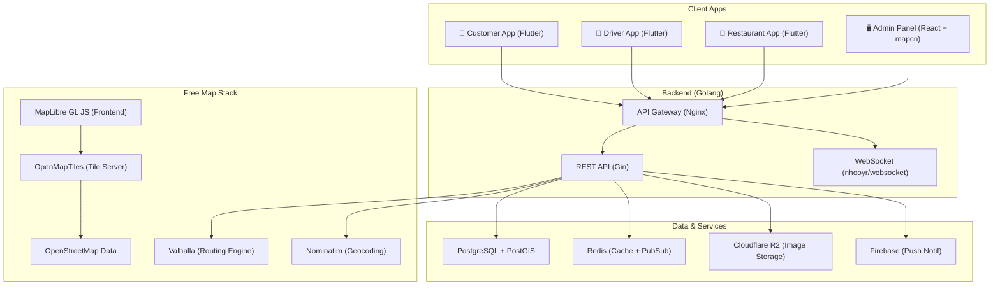
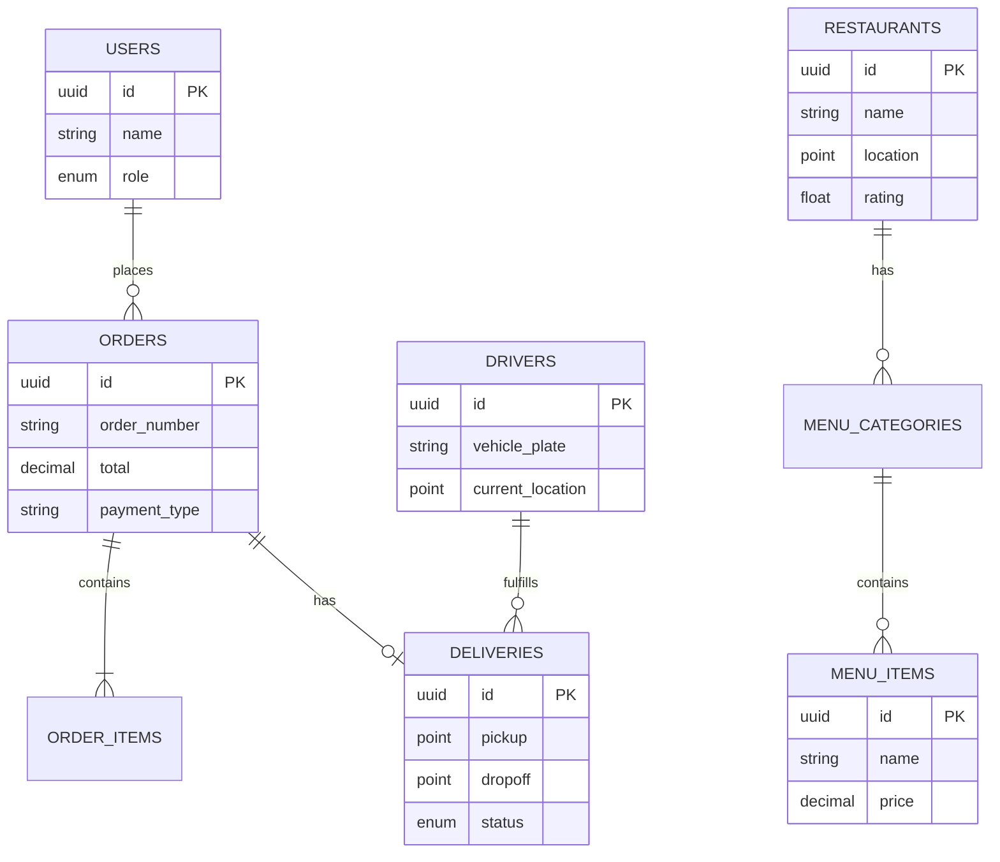
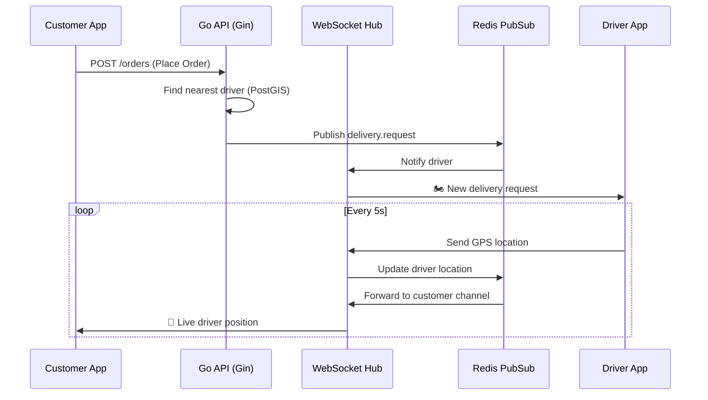

# Project Proposal: KUWRIR Food Delivery Platform

## 1. Executive Summary

This proposal outlines the development of **KUWRIR**, a comprehensive food delivery platform similar to GoFood. The platform connects customers, restaurant partners, and delivery drivers through three dedicated mobile applications and a centralized administrative dashboard. 

A key differentiator of this proposal is the strategic use of a **100% free, open-source mapping stack**, eliminating recurring third-party API costs (e.g., Google Maps) while maintaining premium features like turn-by-turn navigation and real-time tracking. This approach yields an estimated savings of ~$22,000 annually.

## 2. Project Scope & Deliverables

The project encompasses the delivery of four distinct applications and a robust backend infrastructure:

### 2.1. Customer App (Mobile)
*   **Discovery:** Browse nearby restaurants, view menus, and search for specific items.
*   **Ordering:** Cart management, promo code application, and Cash on Delivery (COD) checkout.
*   **Real-time Tracking:** Live map view of the driver's location and ETA.
*   **Engagement:** Order history, favorites, reviews, and in-app chat.

### 2.2. Driver App (Mobile)
*   **Onboarding:** Document submission and verification.
*   **Job Management:** Receive, accept/reject, and manage delivery requests.
*   **Navigation:** Turn-by-turn routing utilizing custom motorcycle profiles.
*   **Earnings:** Track daily/weekly income and request withdrawals.

### 2.3. Restaurant App (Mobile)
*   **Order Operations:** Manage incoming orders (accept, prepare, ready for pickup).
*   **Menu Management:** Create and edit categories, items, and add-ons in real-time.
*   **Store Management:** Update operating hours and toggle store availability.
*   **Insights:** View sales reports and respond to customer reviews.

### 2.4. Admin Dashboard (Web)
*   **Monitoring:** High-level KPIs, live order tracking, and system health.
*   **User Management:** Oversee customers, verify drivers, and approve restaurants.
*   **Financials:** Manage configurable service fees, track driver cash deposits, and process monthly restaurant settlements.
*   **Marketing:** Create promotional campaigns and broadcast push notifications.

---

## 3. App Flow & Financial Logic (MVP COD Model)

For the initial launch (MVP), the platform will operate exclusively on a **Cash on Delivery (COD)** model. Digital payments will be introduced in future phases. The financial logic is highly configurable via the Admin Panel to adapt to market conditions without requiring app updates.

### 3.1. Configurable System Parameters

| Setting Key | Description | Current Config |
| :--- | :--- | :--- |
| `food_markup_percentage` | Markup added to the restaurant's base price. **Passed to the customer.** | `15%` |
| `delivery_commission_percentage` | The percentage of the delivery fee that KUWRIR retains. | `25%` |
| `delivery_base_fee_inside_zone` | Fixed delivery fee for customers inside the designated zone. | `IDR 15,000` |
| `delivery_fee_per_km_outside` | Additional fee per kilometer for deliveries outside the zone. | `IDR 10,000` / km |

### 3.2. Financial Calculation Example (Inside Zone)

*   **Order Details:** 1x Ayam Bakar (Restaurant Base Price: IDR 50,000)
*   **Customer App Display & Payment:**
    *   Food Price Displayed: `IDR 50,000 + (15% markup)` = **IDR 57,500**
    *   Delivery Fee: **IDR 15,000**
    *   **Total Customer Pays (in Cash to Driver): IDR 72,500**

**Revenue Split (Calculated by Admin/Backend):**
From the IDR 72,500 collected in cash:
*   **Restaurant Share:** IDR 50,000 (Their base price)
*   **Driver Share:** IDR 11,250 (75% of the 15k Delivery Fee)
*   **KUWRIR Revenue:** IDR 7,500 (15% Food Markup) + IDR 3,750 (25% of Delivery Fee) = **IDR 11,250**

### 3.3. Order Lifecycle & Cash Handling Flow

1.  **Order Placement:** Customer sees menu prices with the 15% markup applied and places the order (COD).
2.  **Preparation:** Restaurant accepts, prepares, and marks the food "Ready to Pickup".
3.  **Delivery & Cash Collection:** The assigned driver picks up the food, delivers it using turn-by-turn navigation, and **collects the full cash amount** (e.g., IDR 72,500) from the customer.
4.  **Driver Deposit:** At the end of a designated period, the driver deposits the collected cash to the Admin. The Admin Panel tracks exactly how much cash each driver owes the platform.
5.  **Settlement to Restaurant:** The Admin calculates total completed orders per restaurant over a period (e.g., monthly). The Admin transfers the total Base Food Prices to the restaurant's bank account.

---

## 4. Technology Architecture

The technology stack is selected for performance, scalability, and cost-efficiency.

### 4.1. Detailed Stack Recommendations

**🔧 Backend: Golang + Gin**
*   **Framework:** Gin (Most mature Go web framework, battle-tested)
*   **ORM:** GORM (With PostgreSQL + PostGIS support)
*   **WebSocket:** nhooyr/websocket (Modern, stdlib-compatible)

**🖥️ Admin Panel: React + Vite + mapcn**
*   **UI Components:** shadcn/ui + Radix (Modern design, code ownership)
*   **Map Components:** **mapcn** (React maps built on MapLibre and styled with Tailwind)

**📱 Mobile Apps: Flutter**
*   A single codebase handles all 3 mobile apps (Customer, Driver, Restaurant), sharing critical logic (API clients, models, maplibre_gl integration).

### 4.2. Zero-Cost Mapping Infrastructure

Instead of relying on costly proprietary APIs, we deploy a self-hosted, open-source geospatial stack:

| Service | Tool | Replaces |
|---|---|---|
| **Map Display** | MapLibre GL JS / maplibre_gl | Google Maps SDK |
| **Routing/ETA** | **Valhalla** (self-hosted) | Google Directions API |
| **Geocoding** | **Nominatim** (self-hosted) | Google Geocoding API |
| **Map Data** | OpenStreetMap | Google's proprietary data |

> [!TIP]
> **Why Valhalla over OSRM?** Valhalla supports custom vehicle profiles (motorcycle/scooter), time-dependent routing, isochrone maps, and turn-by-turn navigation.

---

## 5. Database & Real-Time Design

### 5.1. Core Entity Relationship (ERD)

### 5.2. Real-Time Tracking Architecture (WebSockets)

---

## 6. Development Timeline & Phases

The project will be executed over an estimated **22-24 week (6-month)** timeline, divided into six distinct phases.

| Phase | Weeks | Focus & Deliverables |
|---|---|---|
| **1. Foundation** | 1-3 | Go project scaffold, Docker (PostgreSQL, Redis, Valhalla, Nominatim), Auth API, DB migrations, Flutter & React scaffolds. |
| **2. Restaurant & Menu** | 4-6 | Restaurant/Menu CRUD APIs, Image upload (Cloudflare R2), Customer home screen & search, Admin restaurant management. |
| **3. Cart & Orders** | 7-10 | Cart logic, Order placement, Cash on Delivery (COD) workflow, Order state machine, Restaurant active order queue. |
| **4. Delivery & Real-Time**| 11-14 | Geospatial driver matching (PostGIS), WebSocket hub, Live tracking (MapLibre + Valhalla), Driver app navigation, In-app chat. |
| **5. Ratings & Financials** | 15-18 | Review system, Admin driver cash deposit tracking, Restaurant monthly settlement calculation, Promo engine. |
| **6. Polish & Launch** | 19-22 | Performance tuning, security audit, E2E testing, App Store preparation, Production deployment. |

---

## 7. Resource & Cost Estimation

### 7.1. Recommended Team Structure
*   **1x Project Manager / Scrum Master** (Part-time)
*   **1x UI/UX Designer** (Weeks 1-8 primarily)
*   **1x Backend Engineer (Golang)** (Full-time)
*   **2x Mobile Engineers (Flutter)** (Full-time)
*   **1x Frontend Engineer (React)** (Full-time)
*   **1x DevOps / QA Engineer** (Part-time)

*Total Estimated Effort: ~19 Man-Months*

### 7.2. Cost Comparison: Google Maps vs Free Stack (Annual)

| Service | Google Maps Estimate | Free Stack | Annual Savings |
|---|---|---|---|
| Map Display | $7 / 1,000 loads | **$0** (MapLibre + OSM) | ~$2,500/yr |
| Routing / ETA | $5-$10 / 1,000 requests | **$0** (Valhalla self-hosted) | ~$15,000/yr |
| Geocoding | $5 / 1,000 requests | **$0** (Nominatim self-hosted) | ~$5,000/yr |
| Server Infra | — | ~$20-$50/mo VPS | -$600/yr |
| **Total** | | | **~$22,000/yr saved** |

### 7.3. Estimated Infrastructure Costs (Monthly - Production)

We offer two deployment strategies depending on your initial scale and budget:

#### Option A: Single VPS (Highly Recommended for MVP in Kuta, Lombok)
Because the initial launch is focused strictly on the tourist area of Kuta, Lombok, the map data (OpenStreetMap) required for routing and search is extremely small. This drastically reduces the RAM requirements for the mapping servers. All services (API, DB, Maps, Cache) can be comfortably hosted on a single, affordable server.
*   *Spec:* 4 vCPUs, 8GB RAM, 100GB NVMe SSD
*   *Requirements:* We will extract and load OSM data specifically for the island of Lombok (or West Nusa Tenggara), ensuring ultra-fast routing with minimal memory usage. Product images will be stored off-server using Cloudflare R2.
*   **Total Estimated Monthly Infra:** ~$48/month (DigitalOcean/Vultr) or ~$15-$20/month (Hetzner/Contabo)

#### Option B: Distributed Architecture (For High Scalability)
As the platform scales across multiple cities with high concurrent users, we separate the services to prevent bottlenecks.
*   **API & Web Server:** 4 vCPUs, 8GB RAM (~$48/month)
*   **Database Server (PostGIS):** 4 vCPUs, 8GB RAM (~$48/month)
*   **Mapping Server (Valhalla/Nominatim):** 8 vCPUs, 16GB RAM (~$96/month)
*   **Cache:** 2 vCPUs, 2GB RAM (~$18/month)
*   **Object Storage (Cloudflare R2):** Included in Cloudflare plan (Free up to 10GB/mo, zero egress fees).
*   **Total Estimated Monthly Infra:** ~$210/month

---

## 8. Next Steps: Project Kickoff

All prerequisites and open questions have been resolved:
*   **Target Region:** Confirmed as Kuta, Lombok (Single VPS).
*   **App Name:** Confirmed as KUWRIR.
*   **Design Assets:** Using existing assets.

Upon formal approval of this proposal, development will immediately commence with Phase 1 (Foundation & Infrastructure setup).
